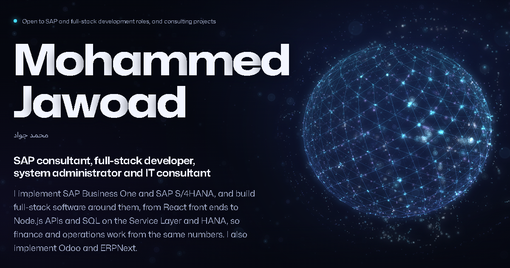

## Hi, I'm Mohammed Jawoad

SAP consultant, full-stack developer, system administrator and IT consultant in Baghdad, Iraq. I implement **SAP Business One and SAP S/4HANA**, build full-stack applications around them with **React, TypeScript, Node.js and SQL**, and run the servers, networks and security they depend on. I also implement **Odoo and ERPNext**.

استشاري SAP ومطوّر برمجيات Full-Stack ومدير أنظمة واستشاري تقنية معلومات في بغداد: أنفّذ SAP Business One و SAP S/4HANA، وأبني حولهما تطبيقات متكاملة بـ React و Node.js و SQL، وأدير الخوادم والشبكات والأمن. وأنفّذ أيضاً Odoo و ERPNext.

**Website:** [mohammedjawoad.me](https://mohammedjawoad.me) (English and [Arabic](https://mohammedjawoad.me/ar/))

- 8+ years in IT and ERP
- 7 SAP-integrated applications built for a multi-company group
- 54 financial reports automated on SAP HANA, with 23 of 23 closed-month checks matched to the cent

### What I do

- **SAP Business One and S/4HANA:** consulting and implementation across finance, procurement, sales, inventory and production
- **Full-stack development:** React and TypeScript front ends, Node.js APIs (Express, Hono, tRPC) and SQL, connected to SAP through the Service Layer and HANA
- **System administration:** Windows Server, Linux, networking, virtualization, security, backup and disaster recovery
- **IT consulting:** requirements, solution design, UAT, go-live and user training
- **Financial reporting and consolidation:** multi-company, multi-currency (IQD and USD)
- **Odoo and ERPNext:** implementation and custom Odoo modules

### Featured

- [**Website**](https://mohammedjawoad.me): projects, experience and CV, in English and Arabic
- [**ERP case studies**](https://github.com/mohammedjawoad-sketch/erp-case-studies): seven SAP Business One applications, how they connect to SAP and what they changed
- [**SAP B1 ticket system**](https://github.com/mohammedjawoad-sketch/sapb1ticketsystem): support tickets and tasks for SAP Business One teams
- [**Website source**](https://github.com/mohammedjawoad-sketch/mohammedjawoad-portfolio): React, TypeScript and a WebGL2 particle engine

### Tools

SAP B1 10.0 on HANA, SAP S/4HANA, Service Layer, B1if, Crystal Reports, TypeScript, React, Node.js, Express, Hono, tRPC, SQL Server, PostgreSQL, Git, Docker, Windows Server, Linux, Odoo, ERPNext

### Contact

[Website](https://mohammedjawoad.me) | [LinkedIn](https://www.linkedin.com/in/mohammed-jawoad-219a75159) | [Email](mailto:mohammedjawoad@gmail.com) | [WhatsApp](https://wa.me/9647725501097)

Open to SAP, full-stack and system administration roles, and to consulting projects. Based in Baghdad, working on-site in Iraq and remotely.
